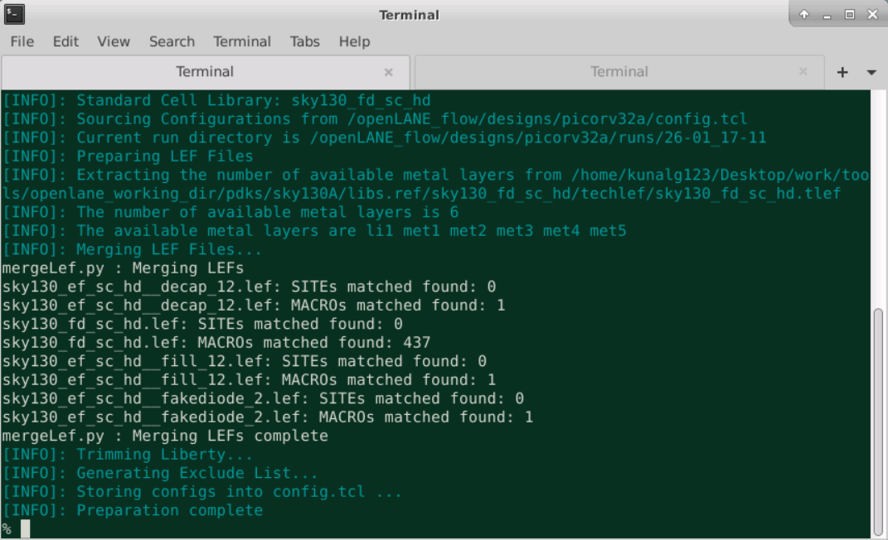
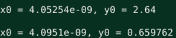
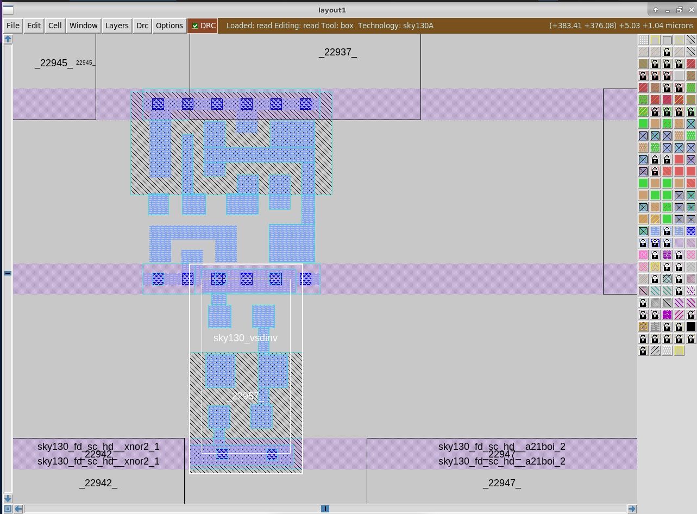

# Advanced Physical Design Workshop using OpenLANE sky130

# About

A cloud based 5 day training workshop which offered insights into design and characterization standard cell, and a hands-on in the Physical Design Domain (RTL to GDSII) using OpenLANE as the EDA tool and sky130 as the PDK.

Workshop conducted by VLSI System Design : [VSD website](https://www.vlsisystemdesign.com/)

# Outline

1. [Introduction](#1-introduction)
2. [Day 1 - Inception of open-source EDA, OpenLANE and sky130 PDK](#2-day-1---inception-of-open-source-eda-openlane-and-sky130-pdk) 
3. [Day 2 - Good floorplan vs bad floorplan and Introduction to Library cells](#3-day-2---good-floorplan-vs-bad-floorplan-and-introduction-to-library-cells)
4. [Day 3 - Design Library cells using magic layout and ngspice characterisation](#4-day-3---design-library-cells-using-magic-layout-and-ngspice-characterisation)
5. [Day 4 - Pre-layout timing analysis and importance of good clock tree](#5-day-4---pre-layout-timing-analysis-and-importance-of-good-clock-tree)
6. [Day 5 - RTL2GDS using TritonRoute and OpenSTA](#6-day-5---rtl2gds-using-tritonroute-and-opensta)
7. [Summary](#7-summary)
8. [Acknowledgement](#8-acknowledgement)
9. [Bibliography](#9-bibliography)

Revision notes: Only lab screenshots uploaded.

# 1. Introduction

The housing that integrated circuits (chips) are placed in. The package is then either plugged into (socket mount) or soldered onto (surface mount) the printed circuit board. Creating a mounting for a chip might seem trivial, but chip packaging is a complicated industry. Being able to provide more interconnections to a bare chip (bare die) that is increasingly shrinking in size is an ever-present problem. In addition, smaller package sizes allow more chips to be placed inside phones and other handheld devices. 

# 2. Day 1 - Inception of open-source EDA, OpenLANE and sky130 PDK

|  | 
|:--:| 
|Fig. 1. Path to enter the working directory|

|  | 
|:--:| 
|Fig. 2. Directory structure inside pdks|

|  | 
|:--:| 
|Fig. 3. PDK(Process Design Kit) files for different process corners |

|  | 
|:--:| 
|Fig. 4. Technology files for various open-source tools|

|  | 
|:--:| 
|Fig. 5. Process specific files|

|  | 
|:--:| 
|Fig. 6. Process specific Design Exchange Format (def) files|

|  | 
|:--:| 
|Fig. 7. Openlane directory structure |

|  | 
|:--:| 
|Fig. 8. Design files that come with the tool |

|  | 
|:--:| 
|Fig. 9. config.tcl file - where all parameters are set - second highest priority |

|  | 
|:--:| 
|Fig. 10. Contents of the file - design specific |

|  | 
|:--:| 
|Fig. 11. Process Specific config.tcl file - highest priority for any design |

|  | 
|:--:| 
|Fig. 12. Invoking OpenLANE and preparing the design |

|  | 
|:--:| 
|Fig. 13. Notification of successful design preparation|

|  | 
|:--:| 
|Fig. 14. Creation of runs folder - result of design prep|

|  | 
|:--:| 
|Fig. 15. Directory Structure of 'runs' and 'tmp'|

|  | 
|:--:| 
|Fig. 16. config.tcl file used by OpenLANE flow|

|  | 
|:--:| 
|Fig. 17. Successful synthesis|

|  | 
|:--:| 
|Fig. 18. Overall statistics of cells used|

|  | 
|:--:| 
|Fig. 19. Number of D- Flip Flops used|

|  | 
|:--:| 
|Fig. 20. Area used by the module|

|  | 
|:--:| 
|Fig. 21. Path to access Synthesis reports|

|  | 
|:--:| 
|Fig. 22. Stat report - shown for example|

# 3. Day 2 - Good floorplan vs bad floorplan and Introduction to Library cells

|  | 
|:--:| 
|Fig. 23. ASIC flow step-specific configuration files - default variable values assignment|

|  | 
|:--:| 
|Fig. 24. Variable with descriptions and possible values|

|  | 
|:--:| 
|Fig. 25. floorplan.tcl|

|  | 
|:--:| 
|Fig. 26. Command to run floorplan|

|  | 
|:--:| 
|Fig. 27. Successful completion of floorplan with the generation of PDN def|

|  | 
|:--:| 
|Fig. 28. Floorplan log files|

|  | 
|:--:| 
|Fig. 29. ioPlacer.log|

|  | 
|:--:| 
|Fig. 30. Floorplan and PDN results|

|  | 
|:--:| 
|Fig. 31. Path to access floorplan def file|

|  | 
|:--:| 
|Fig. 32. Contents of floorplan.def file|

|  | 
|:--:| 
|Fig. 33. Procedure to open the def file using magic - for visualisation|

|  | 
|:--:| 
|Fig. 34. Layout zoomed to show equidistant IO pins|

|  | 
|:--:| 
|Fig. 35. Selection of a horizontal IO pin|

|  | 
|:--:| 
|Fig. 36. Viewing the metal layer|

|  | 
|:--:| 
|Fig. 37. Selection of a vertical IO pin|

|  | 
|:--:| 
|Fig. 38. Viewing the metal layer|

|  | 
|:--:| 
|Fig. 39. Presence of tap and decap cells|

|  | 
|:--:| 
|Fig. 40. Unplaced logic cells|

|  | 
|:--:| 
|Fig. 41. Verifying the logic cells|

|  | 
|:--:| 
|Fig. 42. Verifying the logic cells - contd.|

|  | 
|:--:| 
|Fig. 43. Floorplan variable values that were used in the flow|

# 4. Day 3 - Design Library cells using magic layout and ngspice characterisation

|  | 
|:--:| 
|Fig. 44. Dynamic assignment of variables|

|  | 
|:--:| 
|Fig. 45. Change in IO pin placement|

|  | 
|:--:| 
|Fig. 46. Magic command to open above layout - for reference|

|  | 
|:--:| 
|Fig. 47. Cloning of vsdstdcelldesign repository|

|  | 
|:--:| 
|Fig. 48. Contents of vsdstdcelldesign repo|

|  | 
|:--:| 
|Fig. 49. Layout of inverter|

|  | 
|:--:| 
|Fig. 50. Viewing the inference of the tool based on the layers used|

|  | 
|:--:| 
|Fig. 51. Inference - contd.|

|  | 
|:--:| 
|Fig. 52. Highlighting the metal contacts |

|  | 
|:--:| 
| Fig. 53. Generated extracted spice file|

|  | 
|:--:| 
| Fig. 54. Generated spice netlist |

|  | 
|:--:| 
| Fig. 55. Netlist of inverter|

|  | 
|:--:| 
| Fig. 56 Dimensions used by the magic tool|

|  | 
|:--:| 
| Fig. 57. Contents of nshort.lib|

|  | 
|:--:| 
| Fig. 58 Modified netlist to run simulation|

|  | 
|:--:| 
| Fig. 59 Successful simulation|

|  | 
|:--:| 
| Fig. 60 Plot of input and output pulse|

|  | 
|:--:| 
| Fig. 61 Reduced spikes after increasing load capacitance|

|  | 
|:--:| 
| Fig. 62 Rise time|

|  | 
|:--:| 
| Fig. 63 Fall time|

|  | 
|:--:| 
| Fig. 64 Rise propagation delay|

|  | 
|:--:| 
| Fig. 65 Fall propagation delay|

|  | 
|:--:| 
| Fig. 66 Test files for DRC |

|  | 
|:--:| 
| Fig. 67 Contents of DRC config file, with local reference to sky130 technology file|

|  | 
|:--:| 
| Fig. 68 Metal 3 layer magic file|

|  | 
|:--:| 
| Fig. 69 DRC rule violation|

|  | 
|:--:| 
| Fig. 70 Metal 3 Contact layer with CIF contact slots, satisfying the DRC rule automatically|

|  | 
|:--:| 
| Fig. 71 Verification of distance values|

|  | 
|:--:| 
| Fig. 72 Poly magic file|

|  | 
|:--:| 
| Fig. 73 poly.9 rule defined by skywater pdk for 130nm process|

|  | 
|:--:| 
| Fig. 74 Rule not satisfied, but no error shown thus pointing out the error in the drc file|

|  | 
|:--:| 
| Fig. 75 Loading modified tech file|

# 5. Day 4 - Pre-layout timing analysis and importance of good clock tree

|  | 
|:--:| 
| Fig. 76 Track details with width, height and pitch values|

|  | 
|:--:| 
| Fig. 77 Command to draw the grids|

|  | 
|:--:| 
| Fig. 78 Verifying the grid rules|

|  | 
|:--:| 
| Fig. 79 Generation of LEF (Library Exchange Format) file|

|  | 
|:--:| 
| Fig. 80 Successful generation of LEF file|

|  | 
|:--:| 
| Fig. 81 Contents of LEF file |

|  | 
|:--:| 
| Fig. 82 Copying required files to src folder|

|  | 
|:--:| 
| Fig. 83 Copying - comtd.|

|  | 
|:--:| 
| Fig. 84 Modification of config.tcl to include the .lib and custom .lef file|

|  | 
|:--:| 
| Fig. 85 Design Prep and Synthesis|

|  | 
|:--:| 
| Fig. 86 Area of the chip with default SYNTH_* variables|

|  | 
|:--:| 
| Fig. 87 Increase in area and zero slack after modifying SYNTH_STRATEGY and SYNTH_SIZING|

|  | 
|:--:| 
| Fig. 88 Presence of custom inverter cell in merged.lef|

|  | 
|:--:| 
| Fig. 89 Successful floorplan|

|  | 
|:--:| 
| Fig. 90 Module after floorplan - viewed using magic|

|  | 
|:--:| 
| Fig. 91 Presence of custom inverter cell in the layout|

|  | 
|:--:| 
| Fig. 92 Metal contacts satisfying rules|

|  | 
|:--:| 
| Fig. 93 Moving my_base.sdc for STA|

|  | 
|:--:| 
| Fig. 94 Modified sta.conf file|

|  | 
|:--:| 
| Fig. 95 Invoking OpenSTA|

|  | 
|:--:| 
| Fig. 96 Slack using max and min lib files using OpenSTA|

|  | 
|:--:| 
| Fig. 97 Slack improvement after modifying SYNTH_MAX_FANOUT|

|  | 
|:--:| 
| Fig. 98 Successful Clock Tree Synthesis|

|  | 
|:--:| 
| Fig. 99 Inferring CTS variable values set by the flow|

|  | 
|:--:| 
| Fig. 100 Checking slack by using OpenROAD within Openlane|

|  | 
|:--:| 
| Fig. 101 Hold violation with min and max .lib files|

|  | 
|:--:| 
| Fig. 102 Setup violation with min and max .lib files|

|  | 
|:--:| 
| Fig. 103 No setup violation while using typical .lib file for timing analysis|

|  | 
|:--:| 
| Fig. 104 No hold violation while using typical .lib file for timing analysis|

# 6. Day 5 - RTL2GDS using TritonRoute and OpenSTA

|  | 
|:--:| 
| Fig. 105 To run routing|

|  | 
|:--:| 
| Fig. 106 Successful routing|

|  | 
|:--:| 
| Fig. 107 Demonstration of starting from the optimised design files|

|  | 
|:--:| 
| Fig. 108 Successful RC extraction|

|  | 
|:--:| 
| Fig. 109 PDN layout|

|  | 
|:--:| 
| Fig. 110 Steps to run final command - run_magic - to generate GDSII file|

|  | 
|:--:| 
| Fig. 111 Successful completion of the OpenLANE flow|

|  | 
|:--:| 
| Fig. 112 Directory to find the streamed GDS file|

|  | 
|:--:| 
| Fig. 113 Command to view GDS file using magic|

|  | 
|:--:| 
| Fig. 114 GDS file opened using magic|

|  | 
|:--:| 
| Fig. 115 Final GDS output|

# 7. Summary

[Workshop Notes - explaining all theory](docs/VSD_Physical_Design.pdf)

The outcomes of this workshop are as follows:
 - How to talk to computers
 - SoC design and OpenLANE
 - Starting RISC-V SoC Reference design
 - Get familiar to open-source EDA tools
 - Chip Floor planning considerations
 - Library Binding and Placement
 - Cell design and characterization flows
 - General timing characterization parameters
 - Labs for CMOS inverter ngspice simulations
 - Inception of Layout – CMOS fabrication process
 - Sky130 Tech File Labs
 - Timing modelling using delay tables
 - Timing analysis with ideal clocks using openSTA
 - Clock tree synthesis TritonCTS and signal integrity
 - Timing analysis with real clocks using openSTA
 - Routing and design rule check (DRC)
 - PnR interactive flow tutorial

# 8. Acknowledgement

The above work was carried out as a part of the 5-day workshop on Advanced Physical Design organised by VLSI System Design. I am greatly indebted to Kunal Ghosh (course instructor), Timothy Edwards (Guest Instructor), Mohammed Shalan (Guest Instructor), Nickson Jose (Lab Instructor), Sumanto Kar, efabless and the entire VSD Team for this great learning experience and immense guidance provided throughout the workshop.

# 9. Bibliography

https://skywater-pdk.readthedocs.io/en/main/

https://openlane.readthedocs.io/en/latest/

https://github.com/The-OpenROAD-Project/OpenLane

https://github.com/nickson-jose/vsdstdcelldesign

