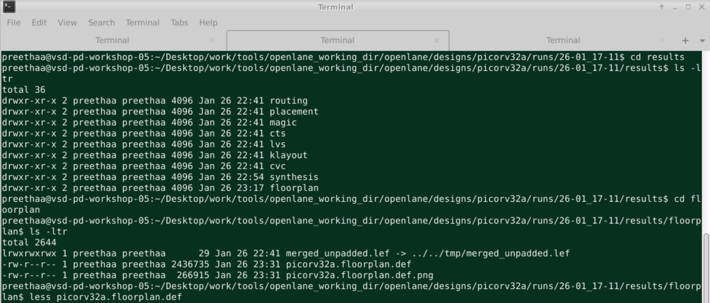
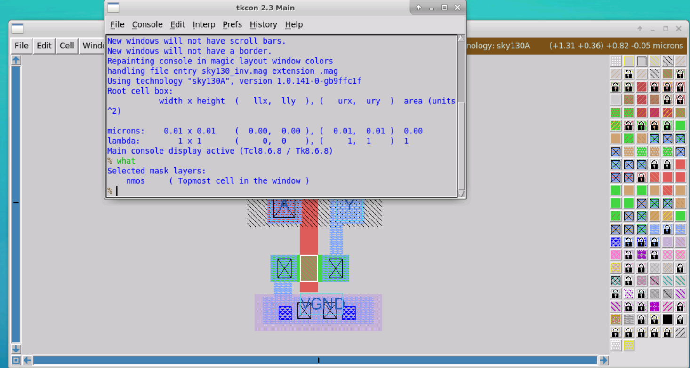
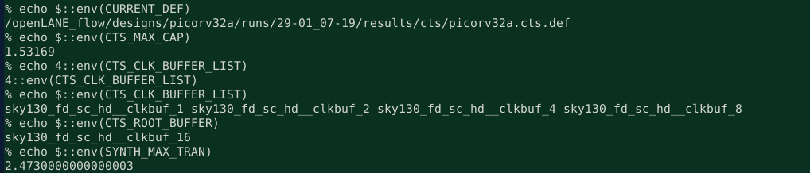

# Advanced Physical Design Workshop using OpenLANE sky130

# About

A cloud based 5 day training workshop which offered insights into design and characterization standard cell, and a hands-on in the Physical Design Domain (RTL to GDSII) using OpenLANE as the EDA tool and sky130 as the PDK.

Workshop conducted by VLSI System Design : [VSD website](https://www.vlsisystemdesign.com/)

Workshop sponsored by: efabless

# Outline

1. [Introduction](#1-introduction)
2. [Day 1](#2-Day-1) 
3. [Day 2](#3-Day-2)
4. [Day 3](#4-Day-3)
5. [Day 4](#5-Day-4)
6. [Day 5](#6-Day-5)
7. [Summary](#3-summary)
8. [Acknowledgement](#4-acknowledgement)
9. [Bibliography](#5-bibliography)

# 1. Introduction

# 2. Day 1

|  | 
|:--:| 
| Files used throughout the course|

|  | 
|:--:| 
| Files used throughout the course|

|  | 
|:--:| 
| Files used throughout the course|

|  | 
|:--:| 
| Files used throughout the course|

|  | 
|:--:| 
| Files used throughout the course|

|  | 
|:--:| 
| Files used throughout the course|

|  | 
|:--:| 
| Files used throughout the course|

|  | 
|:--:| 
| Files used throughout the course|

|  | 
|:--:| 
| Files used throughout the course|

|  | 
|:--:| 
| Files used throughout the course|

|  | 
|:--:| 
| Files used throughout the course|

|  | 
|:--:| 
| Files used throughout the course|

|  | 
|:--:| 
| Files used throughout the course|

|  | 
|:--:| 
| Files used throughout the course|

|  | 
|:--:| 
| Files used throughout the course|

|  | 
|:--:| 
| Files used throughout the course|

|  | 
|:--:| 
| Files used throughout the course|

|  | 
|:--:| 
| Files used throughout the course|

|  | 
|:--:| 
| Files used throughout the course|

|  | 
|:--:| 
| Files used throughout the course|

|  | 
|:--:| 
| Files used throughout the course|

|  | 
|:--:| 
| Files used throughout the course|

# 3. Day 2

|  | 
|:--:| 
| Files used throughout the course|

|  | 
|:--:| 
| Files used throughout the course|

|  | 
|:--:| 
| Files used throughout the course|

|  | 
|:--:| 
| Files used throughout the course|

|  | 
|:--:| 
| Files used throughout the course|

|  | 
|:--:| 
| Files used throughout the course|

|  | 
|:--:| 
| Files used throughout the course|

|  | 
|:--:| 
| Files used throughout the course|

|  | 
|:--:| 
| Files used throughout the course|

|  | 
|:--:| 
| Files used throughout the course|

|  | 
|:--:| 
| Files used throughout the course|

|  | 
|:--:| 
| Files used throughout the course|

|  | 
|:--:| 
| Files used throughout the course|

|  | 
|:--:| 
| Files used throughout the course|

|  | 
|:--:| 
| Files used throughout the course|

|  | 
|:--:| 
| Files used throughout the course|

|  | 
|:--:| 
| Files used throughout the course|

|  | 
|:--:| 
| Files used throughout the course|

|  | 
|:--:| 
| Files used throughout the course|

|  | 
|:--:| 
| Files used throughout the course|

|  | 
|:--:| 
| Files used throughout the course|

# 4. Day 3

|  | 
|:--:| 
| Files used throughout the course|

|  | 
|:--:| 
| Files used throughout the course|

|  | 
|:--:| 
| Files used throughout the course|

|  | 
|:--:| 
| Files used throughout the course|

|  | 
|:--:| 
| Files used throughout the course|

|  | 
|:--:| 
| Files used throughout the course|

|  | 
|:--:| 
| Files used throughout the course|

|  | 
|:--:| 
| Files used throughout the course|

|  | 
|:--:| 
| Files used throughout the course|

|  | 
|:--:| 
| Files used throughout the course|

|  | 
|:--:| 
| Files used throughout the course|

|  | 
|:--:| 
| Files used throughout the course|

|  | 
|:--:| 
| Files used throughout the course|

|  | 
|:--:| 
| Files used throughout the course|

|  | 
|:--:| 
| Files used throughout the course|

|  | 
|:--:| 
| Files used throughout the course|

|  | 
|:--:| 
| Files used throughout the course|

|  | 
|:--:| 
| Files used throughout the course|

|  | 
|:--:| 
| Files used throughout the course|

|  | 
|:--:| 
| Files used throughout the course|

|  | 
|:--:| 
| Files used throughout the course|

|  | 
|:--:| 
| Files used throughout the course|

|  | 
|:--:| 
| Files used throughout the course|

|  | 
|:--:| 
| Files used throughout the course|

|  | 
|:--:| 
| Files used throughout the course|

|  | 
|:--:| 
| Files used throughout the course|

|  | 
|:--:| 
| Files used throughout the course|

|  | 
|:--:| 
| Files used throughout the course|

|  | 
|:--:| 
| Files used throughout the course|

|  | 
|:--:| 
| Files used throughout the course|

|  | 
|:--:| 
| Files used throughout the course|

|  | 
|:--:| 
| Files used throughout the course|

|  | 
|:--:| 
| Files used throughout the course|

|  | 
|:--:| 
| Files used throughout the course|

# 5. Day 4

|  | 
|:--:| 
| Files used throughout the course|

|  | 
|:--:| 
| Files used throughout the course|

|  | 
|:--:| 
| Files used throughout the course|

|  | 
|:--:| 
| Files used throughout the course|

|  | 
|:--:| 
| Files used throughout the course|

|  | 
|:--:| 
| Files used throughout the course|

|  | 
|:--:| 
| Files used throughout the course|

|  | 
|:--:| 
| Files used throughout the course|

|  | 
|:--:| 
| Files used throughout the course|

|  | 
|:--:| 
| Files used throughout the course|

|  | 
|:--:| 
| Files used throughout the course|

|  | 
|:--:| 
| Files used throughout the course|

|  | 
|:--:| 
| Files used throughout the course|

|  | 
|:--:| 
| Files used throughout the course|

|  | 
|:--:| 
| Files used throughout the course|

|  | 
|:--:| 
| Files used throughout the course|

|  | 
|:--:| 
| Files used throughout the course|

|  | 
|:--:| 
| Files used throughout the course|

|  | 
|:--:| 
| Files used throughout the course|

|  | 
|:--:| 
| Files used throughout the course|

|  | 
|:--:| 
| Files used throughout the course|

|  | 
|:--:| 
| Files used throughout the course|

|  | 
|:--:| 
| Files used throughout the course|

|  | 
|:--:| 
| Files used throughout the course|

|  | 
|:--:| 
| Files used throughout the course|

|  | 
|:--:| 
| Files used throughout the course|

|  | 
|:--:| 
| Files used throughout the course|

|  | 
|:--:| 
| Files used throughout the course|

|  | 
|:--:| 
| Files used throughout the course|

# 6. Day 5

# 7. Summary

The outcomes of this workshop are as follows:
 - How to talk to computers
 - SoC design and OpenLANE
 - Starting RISC-V SoC Reference design
 - Get familiar to open-source EDA tools
 - Chip Floor planning considerations
 - Library Binding and Placement
 - Cell design and characterization flows
 - General timing characterization parameters
 - Labs for CMOS inverter ngspice simulations
 - Inception of Layout – CMOS fabrication process
 - Sky130 Tech File Labs
 - Timing modelling using delay tables
 - Timing analysis with ideal clocks using openSTA
 - Clock tree synthesis TritonCTS and signal integrity
 - Timing analysis with real clocks using openSTA
 - Routing and design rule check (DRC)
 - PnR interactive flow tutorial

# 4. Acknowledgement

The above work was carried out as a part of the 5-day workshop on Advanced Physical Design organised by VLSI System Design. I am greatly indebted to Kunal Ghosh (course instructor), Timothy Edwards (Guest Instructor), Mohammed Shalan (Guest Instructor), Nickson Jose, efabless and the entire VSD Team for this great learning experience and immense guidance provided throughout the workshop.

# 5. Bibliography

Revision notes: Only lab screenshots uploaded.
