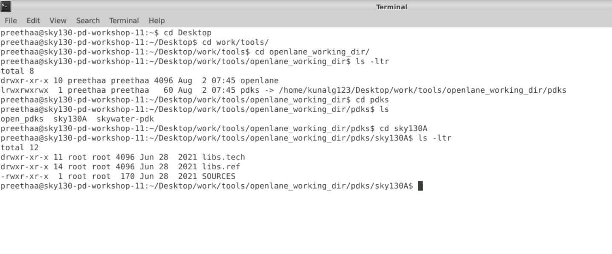
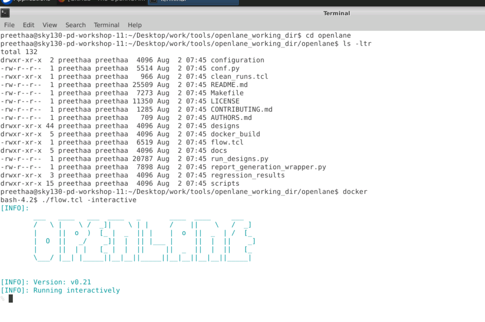
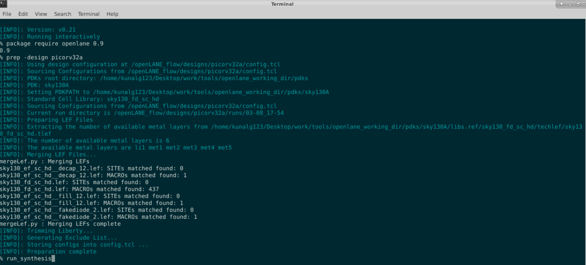
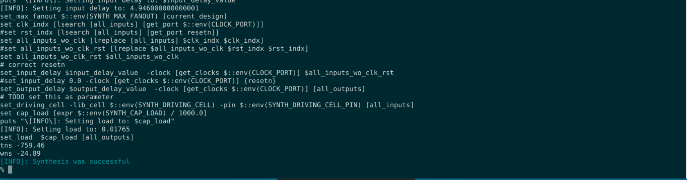
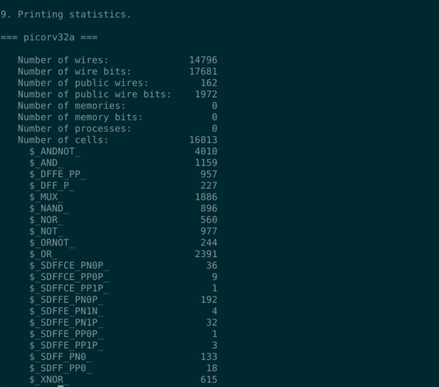
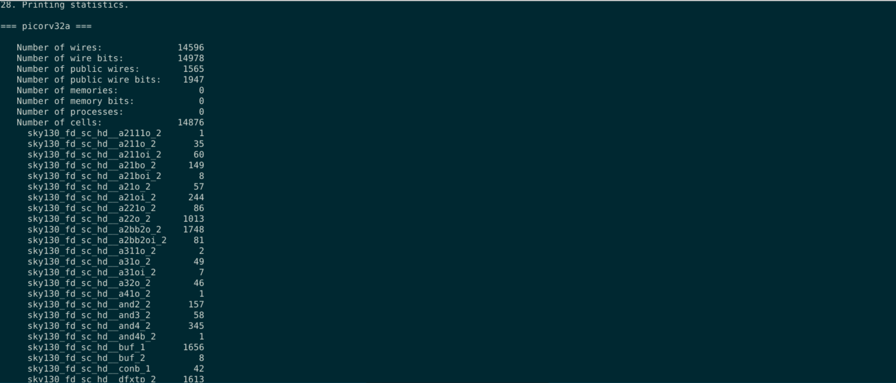

# Advanced Physical Design Workshop using OpenLANE sky130

# About

A cloud based 5 day training workshop which offered insights into design and characterization standard cell, and a hands-on in the Physical Design Domain (RTL to GDSII) using OpenLANE as the EDA tool and sky130 as the PDK.

Workshop conducted by VLSI System Design : [VSD website](https://www.vlsisystemdesign.com/)

Workshop sponsored by: efabless

# Outline

1. [Introduction](#1-introduction)
2. [Design Preparation Step](#2-Design-Preparation-Step) 
3. [Summary](#3-summary)
4. [Acknowledgement](#4-acknowledgement)
5. [Bibliography](#5-bibliography)

# 1. Introduction

# 2. Design Preparation Step

|  | 
|:--:| 
| Files used throughout the course|

|  | 
|:--:| 
| Files used throughout the course|

|  | 
|:--:| 
| Files used throughout the course|

|  | 
|:--:| 
| Files used throughout the course|

|  | 
|:--:| 
| Files used throughout the course|

|  | 
|:--:| 
| Files used throughout the course|

|  | 
|:--:| 
| Files used throughout the course|

# 3. Summary

# 4. Acknowledgement

# 5. Bibliography
